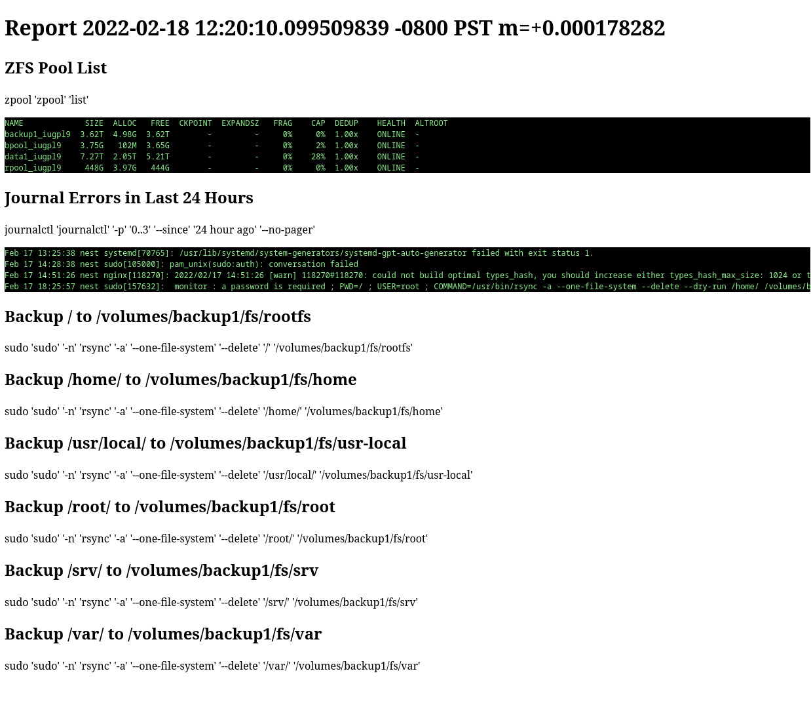

# Readme

This application generates HTML report files that can be viewed over webbrowser to see the status of the remote system.

Report file name is based on the day of the year and can be exposed using web server like `nginx`.

The application can be scheduled to run every day using `systemd`.

## Report Example

Nginx index of reports served by nginx 

## Configuration Example

See example [sysmonitor.yaml](doc/sysmonitor.yaml) file.

## Commands

### Build

    go build .
